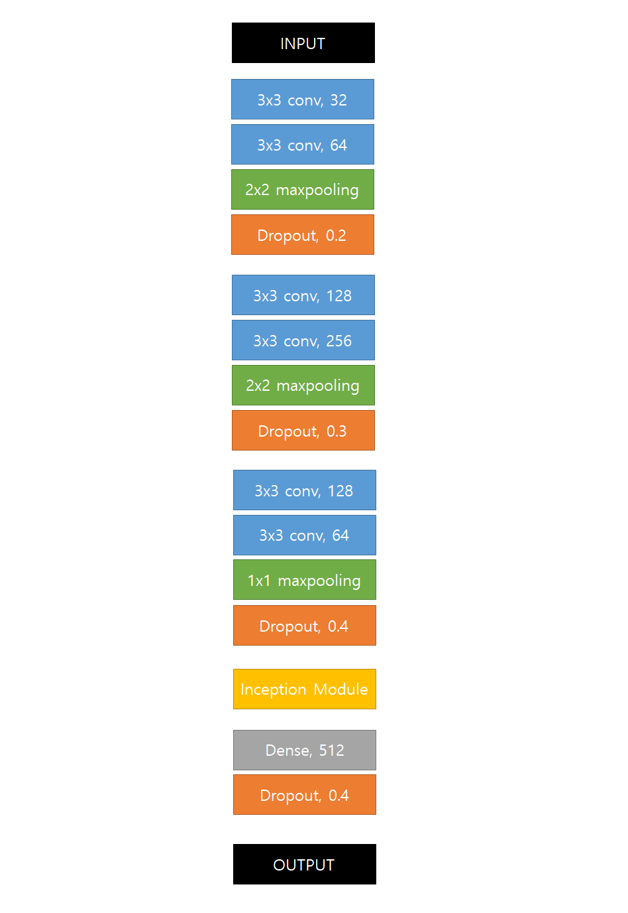
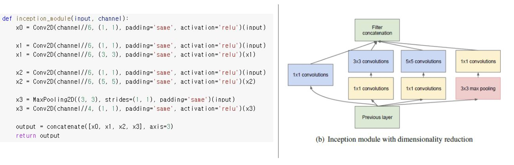
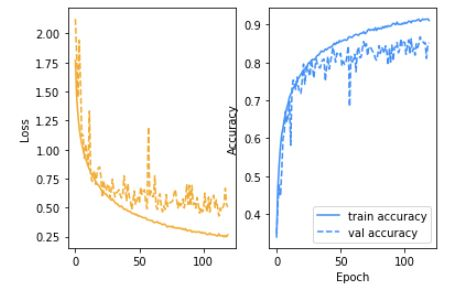
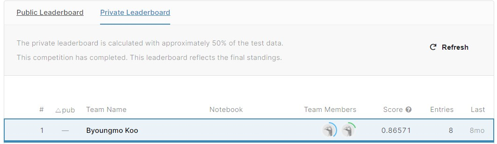

<h2 align="center">💻2021 GPU 서버 기초 및 특강 딥러닝 프로젝트</h2>

<h2>💡 1. 개요</h2>

- 프로젝트: 한성원 교수님 AIDA Lab에서 진행한 특강 프로젝트 [IME Project for Application of GPU Server](https://www.kaggle.com/c/ime/overview)

- 수행기간: `2021.05.28`

- 수행인원: 구병모, 최두혁

- 결과 및 성과: `Public & Private 1등`

- 담당역할: 해당 문제에 적합할 네트워크 모델 리서치(GoogleNet), 모델링, 하이퍼파라미터 수정

<h2>💡 2. 분석 목표</h2>

#### 3주간 배운 딥러닝 지식을 활용해서 주어진 문제를 가장 높은 정확도로 해결하자

<h2>💡 3. 분석 내용</h2>

- 구체적으로 제시되지 않았지만 해당 문제는 이미지 분류 문제로 높은 정확도를 내는 모델을 구축하는 프로젝트였음

- 본 조는 해당 문제를 해결하기 위해 2014년 이미지넷 이미지 인식 대회(ILSVRC)에서 VGGNet을 이기고 우승을 차지한 GoogLeNet을 활용하고자 했음

- 그러나 해당 모델의 층은 너무 깊기에 제한된 시간에 문제를 해결하기에는 소요시간이 너무 길었음

- 따라서 해당 모델을 사용하되 간소화시키고자 했음

- 위와 같이 모델을 구성하여 학습을 진행

- GoogLeNet의 다양한 특징 중 inception module을 활용하고자 했음

<h2>💡 4. 분석 결과</h2>

- 안정적으로 학습하지는 못했음

- Public: 0.86285 

- Private: 0.86571

<h2>💡 5. 한계점</h2>

- 모델에 대한 충분한 학습이 뒷받침 되지 못했음. 단순히 성능을 높이기 위해 적합해보이는 모델을 선택했음

- GoogLeNet 네트워크 모델은 Global Average Pooling과 같은 다른 특징들이 있으나 적용하지 못했음
